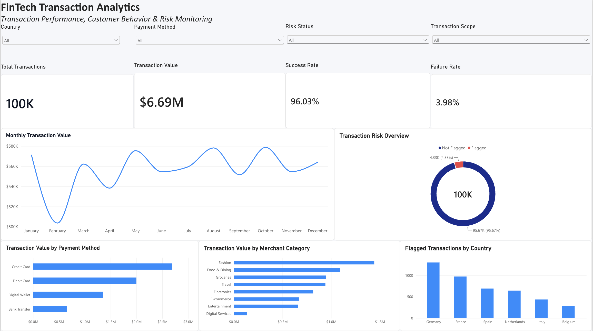
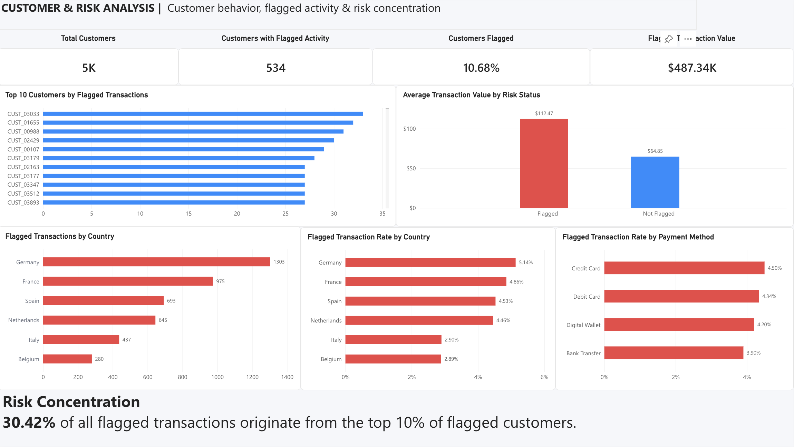

# FinTech Transaction & Risk Analytics

## Project Overview

This project is an end-to-end FinTech data analytics case study built around 100,000 financial transactions.

The goal is to analyze transaction performance, payment failures, customer and merchant behavior, and patterns associated with flagged activity. The project transforms raw transactional data into business insights using PostgreSQL, SQL, DAX, and Power BI.

The analysis focuses on three main areas:

- Transaction performance and payment reliability
- Customer and merchant behavior
- Transaction risk and flagged activity

The final output includes SQL-based analysis and validation, analytical views prepared for reporting, and an interactive Power BI dashboard with Executive Overview and Customer & Risk Analysis pages.

## Business Objective

The objective is to help a FinTech business answer questions such as:

- How much transaction volume and value is being processed?
- How reliable is the payment process?
- Which payment methods experience the highest failure rates?
- What are the main reasons transactions fail?
- Which customers, countries, merchants, and payment methods show elevated flagged activity?
- How concentrated is flagged activity among customers?
- How does flagged transaction behavior differ from non-flagged activity?
- Where should risk-monitoring and payment-performance investigations be prioritized?

## Tools & Technologies

- **PostgreSQL** — database creation, data storage, querying, analytical views, and validation
- **SQL** — KPI analysis, trend analysis, customer analysis, merchant analysis, and risk analysis
- **Power BI** — data modeling, DAX measures, interactive dashboards, and visualization
- **DAX** — calculated measures for customer and transaction risk metrics
- **Python / Jupyter Notebook** — transaction dataset generation
- **CSV** — source data and Power BI reporting export

## Dataset & Data Model

The project analyzes a synthetic FinTech transaction dataset containing:

- **100,000 transactions**
- **5,000 customers**
- **50 merchants**
- Transaction activity covering **January–December 2025**

The dataset is organized into three core CSV files:

### Transactions

The transaction dataset contains the main payment activity used throughout the analysis, including:

- Transaction ID
- Customer ID
- Merchant ID
- Transaction timestamp
- Transaction amount
- Payment method
- Transaction status
- Failure reason
- Device type
- International transaction indicator
- High-value transaction flag
- Multiple-failures flag
- Risk flag

### Customers

Customer information is stored separately and connected to transaction activity through `customer_id`.

Customer attributes are used to analyze transaction behavior and geographic patterns across the customer base.

### Merchants

Merchant information is connected to transactions through `merchant_id` and supports analysis by:

- Merchant
- Merchant category
- Merchant country

### Analytical Structure

The three datasets are combined in PostgreSQL to support transaction-level, customer-level, merchant-level, geographic, and risk analysis.

For Power BI reporting, SQL views were created to prepare reporting-ready datasets for:

- Transaction analysis
- Monthly performance
- Payment methods
- Customer risk profiles
- Merchants
- Countries

This separates the analytical SQL layer from the visualization layer and allows Power BI to work with reporting-ready data rather than raw transactional tables.

## Analysis Workflow

The project follows an end-to-end analytics workflow:

1. Generate and prepare the transaction dataset using Python.
2. Create the PostgreSQL database structure.
3. Load customer, merchant, and transaction data into PostgreSQL.
4. Perform data-quality checks and validation.
5. Calculate core transaction KPIs.
6. Analyze monthly and daily transaction trends.
7. Analyze customer behavior and geographic performance.
8. Analyze merchant and merchant-category performance.
9. Investigate flagged activity and transaction-risk patterns.
10. Validate the risk-flag logic and identify edge cases.
11. Create SQL views optimized for Power BI reporting.
12. Build DAX measures and interactive Power BI dashboards.
13. Translate analytical results into business insights and recommendations.

## Key Findings

### 1. Transaction Performance

The platform processed **100,000 transactions** with a total transaction value of approximately **$6.69M**.

- **Success rate:** 96.03%
- **Failure rate:** 3.98%
- Average transaction value was approximately **$66.92**.
- Transaction activity remained relatively stable across the year, with month-to-month variation visible in the Power BI trend analysis.

Overall payment reliability was high, but the failed transactions provide opportunities for further payment-method and customer-level investigation.

### 2. Customer Activity

The dataset contains **5,000 active customers**, averaging approximately:

- **20 transactions per customer**
- **$1,338.35 in transaction value per customer**

Customer activity was not evenly distributed. Several customers generated substantially more transaction value and activity than the average customer.

### 3. Flagged Activity

A total of **4,333 transactions** were flagged, representing **4.33% of all transactions**.

Flagged transactions represented approximately **$487.34K** in transaction value, with an average flagged transaction value of **$112.47**.

This is substantially higher than the approximately **$64.85 average value of non-flagged transactions**, indicating that flagged activity carries disproportionate financial exposure relative to its transaction count.

### 4. Customer Risk Concentration

Out of **5,000 customers**, **534 customers (10.68%)** had at least one flagged transaction.

Risk activity was highly concentrated among a smaller group of customers:

- The **top 10% of flagged customers** accounted for **30.42% of all flagged transactions**.
- `CUST_03033` recorded **33 flagged transactions**.
- Several high-risk customer profiles had flagged rates above **90%**.

This concentration suggests that customer-level prioritization could make risk-review processes more targeted.

### 5. Geographic Risk Patterns

Flagged transaction rates varied considerably by customer country:

- **Germany:** 5.14%
- **France:** 4.86%
- **Spain:** 4.53%
- **Netherlands:** 4.46%
- **Italy:** 2.90%
- **Belgium:** 2.89%

Germany recorded both the largest number of flagged transactions and the highest flagged transaction rate in the dataset.

### 6. Payment Method Risk

Flagged transaction rates also varied by payment method:

- **Credit Card:** 4.50%
- **Debit Card:** 4.34%
- **Digital Wallet:** 4.20%
- **Bank Transfer:** 3.90%

Credit cards showed the highest flagged rate, although the differences between payment methods were relatively modest.

### 7. International Transaction Exposure

International transactions represented the majority of transaction activity and showed a higher flagged rate than domestic transactions:

- **International flagged rate:** 5.09%
- **Domestic flagged rate:** 0.24%

International transactions also showed a slightly higher failure rate:

- **International failure rate:** 4.04%
- **Domestic failure rate:** 3.63%

This makes transaction scope an important dimension for risk monitoring.

### 8. Merchant Performance

Merchant transaction volumes were broadly distributed across the **50 merchants**, while failure rates differed across individual merchants and categories.

At category level, **E-commerce** recorded the highest failure rate at approximately **4.18%**, followed closely by **Entertainment (4.17%)**.

These differences provide a basis for merchant-level monitoring rather than evaluating payment performance only at the platform level.

## Business Recommendations

Based on the analysis, the following actions could improve transaction monitoring and support more targeted investigation.

### 1. Prioritize High-Risk Customer Profiles

Flagged activity is concentrated among a relatively small group of customers, with the top 10% of flagged customers generating 30.42% of all flagged transactions.

A tiered customer-monitoring approach could therefore prioritize accounts with unusually high flagged transaction counts or rates rather than treating every flagged customer equally.

### 2. Apply Additional Monitoring to International Transactions

International transactions recorded a 5.09% flagged rate compared with only 0.24% for domestic transactions.

Transaction scope should therefore be considered an important risk-monitoring dimension, particularly when international activity is combined with other indicators such as high transaction value or repeated failures.

### 3. Review Higher-Value Flagged Activity First

Flagged transactions averaged approximately $112.47 compared with $64.85 for non-flagged transactions.

When investigation capacity is limited, combining transaction value with existing risk indicators could help prioritize cases with greater potential financial exposure.

### 4. Monitor Geographic Risk Differences

Germany and France recorded the highest flagged transaction rates at 5.14% and 4.86%, respectively.

These differences warrant further investigation into whether customer mix, transaction scope, merchant activity, payment methods, or other factors explain the geographic variation before implementing country-specific controls.

### 5. Investigate Payment-Method Patterns

Credit cards recorded the highest flagged rate among payment methods at 4.50%, followed by debit cards at 4.34%.

Because the differences between payment methods are relatively small, payment method alone should not be treated as a strong risk indicator. It is more useful when analyzed together with customer behavior, transaction value, geography, and transaction scope.

### 6. Establish Merchant Monitoring

Failure rates vary across merchants and merchant categories.

Regular merchant-level monitoring could identify merchants experiencing unusual increases in payment failures or flagged activity and help determine whether additional investigation or operational support is required.

### 7. Continue Monitoring Through Interactive Dashboards

The Power BI dashboards provide a consolidated view of transaction performance and risk indicators.

Tracking success rates, failure rates, flagged activity, customer concentration, geography, payment methods, and merchant performance over time would allow analysts to identify changes in transaction behavior and investigate emerging anomalies.

## SQL Analysis Structure

The SQL workflow is organized into separate scripts so that each stage of the analysis can be reproduced independently.

| File | Purpose |
|---|---|
| `01_create_tables.sql` | Creates the PostgreSQL database tables and relationships |
| `02_load_data.sql` | Loads customer, merchant, and transaction data |
| `03_data_quality.sql` | Performs data-quality and integrity checks |
| `04_kpi_analysis.sql` | Calculates core transaction and payment KPIs |
| `05_trend_analysis.sql` | Analyzes transaction performance over time |
| `06_customer_analysis.sql` | Analyzes customer activity, value, geography, and risk |
| `07_merchant_analysis.sql` | Evaluates merchant and merchant-category performance |
| `08_risk_analysis.sql` | Analyzes transaction-level flagged activity |
| `09_advanced_risk_analysis.sql` | Investigates customer-level risk concentration and behavioral patterns |
| `10_risk_validation.sql` | Validates the rule-based risk logic and edge cases |
| `11_powerbi_views.sql` | Creates reporting-ready SQL views for Power BI |
| `12_powerbi_summary_views.sql` | Creates additional summarized views for dashboard reporting |

## Power BI Dashboard


The final Power BI report contains two interactive analytical pages.

### Page 1 — Executive Overview



The Executive Overview provides a high-level view of transaction performance across the platform.

It includes:

- Total transaction volume
- Total transaction value
- Success and failure rates
- Monthly transaction-value trends
- Overall flagged transaction activity
- Transaction value by payment method
- Transaction value by merchant category
- Flagged transactions by country
- Interactive filters for country, payment method, risk status, and transaction scope

### Page 2 — Customer & Risk Analysis



The Customer & Risk Analysis page focuses on customer-level exposure and patterns associated with flagged activity.

It includes:

- Total customers
- Customers with flagged activity
- Percentage of customers with flagged activity
- Flagged transaction value
- Top customers by flagged transaction count
- Average transaction value by risk status
- Flagged transactions by country
- Flagged transaction rate by country
- Flagged transaction rate by payment method
- Risk-concentration insight showing the share of flagged activity generated by the highest-risk customer group

## Project Structure

```text
fintech-transaction-analytics/
│
├── Data/
│   ├── customers.csv
│   ├── merchants.csv
│   └── transactions.csv
│
├── Python/
│   └── generate_transactions.ipynb
│
├── SQL/
│   ├── 01_create_tables.sql
│   ├── 02_load_data.sql
│   ├── 03_data_quality.sql
│   ├── 04_kpi_analysis.sql
│   ├── 05_trend_analysis.sql
│   ├── 06_customer_analysis.sql
│   ├── 07_merchant_analysis.sql
│   ├── 08_risk_analysis.sql
│   ├── 09_advanced_risk_analysis.sql
│   ├── 10_risk_validation.sql
│   ├── 11_powerbi_views.sql
│   └── 12_powerbi_summary_views.sql
│
├── powerbi_data/
│   └── transaction_analysis.csv
│
├── screenshots/
│   ├── executive-overview.png
│   └── customer-risk-analysis.png
│
└── README.md
``
## Skills Demonstrated

This project demonstrates practical experience across the full data analytics workflow:

- **SQL & PostgreSQL**
  - Relational database design
  - Data loading and validation
  - Joins and aggregations
  - CTEs and analytical queries
  - KPI development
  - Customer and merchant segmentation
  - Risk analysis
  - SQL views for reporting

- **Power BI & DAX**
  - Semantic model configuration
  - DAX measures
  - KPI cards
  - Interactive filtering
  - Customer and transaction risk analysis
  - Dashboard design and data visualization

- **Data Analysis**
  - Data-quality assessment
  - Transaction-performance analysis
  - Trend analysis
  - Customer behavior analysis
  - Merchant performance analysis
  - Risk concentration analysis
  - Validation of analytical logic

- **Business Analytics**
  - Translating data into business insights
  - Identifying operational and risk patterns
  - Comparing normalized rates rather than relying only on raw counts
  - Developing evidence-based monitoring recommendations
  - Communicating findings through dashboards and documentation

## Conclusion

This project demonstrates an end-to-end approach to FinTech transaction analytics, from dataset preparation and PostgreSQL analysis to risk validation, DAX measures, and interactive Power BI reporting.

The analysis identified strong overall payment performance while also revealing meaningful differences in flagged activity across customers, countries, payment methods, transaction scope, and transaction value.

Most importantly, the project demonstrates how transaction data can be transformed into structured analytical insights that support payment-performance monitoring and risk investigation.

---

**Author:** Serajeddin Elgheryani  
**Project:** FinTech Transaction & Risk Analytics
